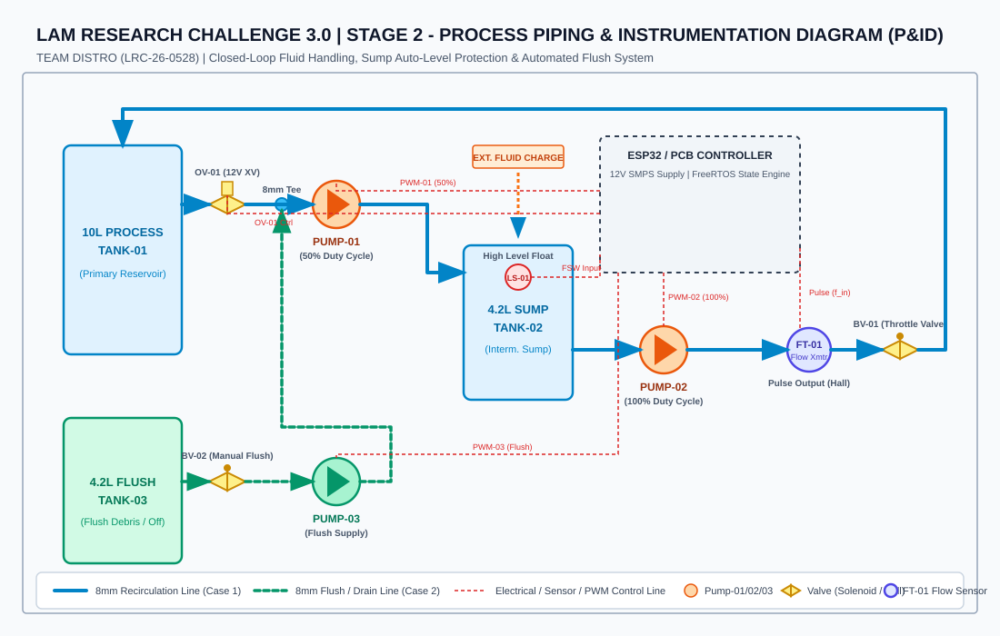
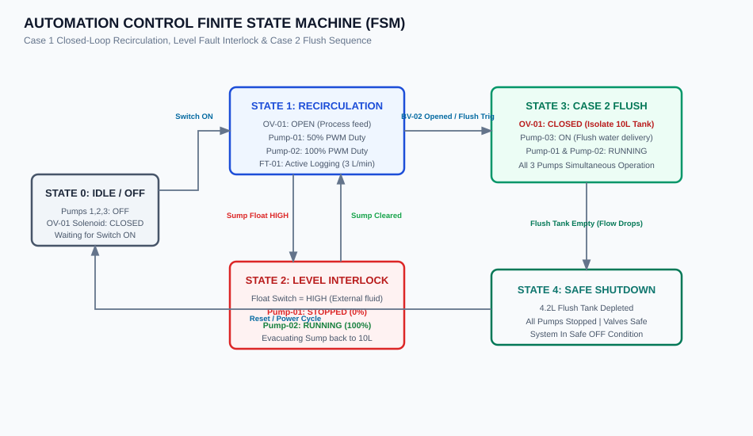
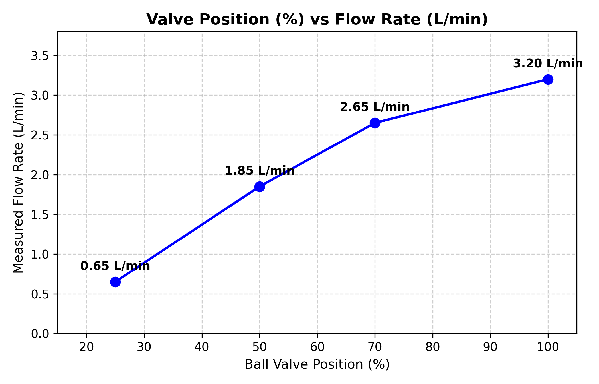
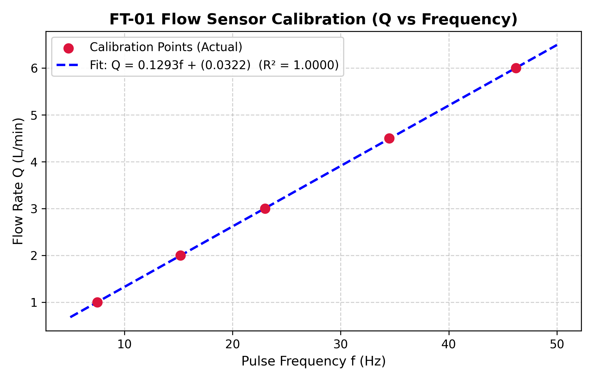
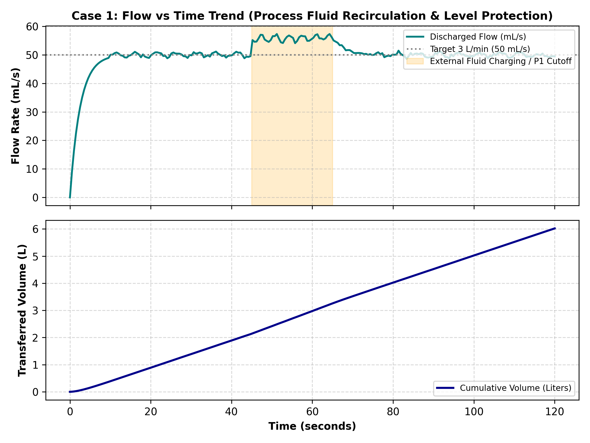

# Lam Research Challenge 3.0 – Stage 2: Practical Engineering Challenge

<div align="center">


### **TEAM DISTRO**
**Industrial Manufacturing Process Automations: Liquid-Handling & Recirculation Control System**

</div>

---

## 📖 Table of Contents
- [1. Project Overview & Problem Statement](#1-project-overview--problem-statement)
- [2. System Architecture & P&ID](#2-system-architecture--pid)
- [3. Automation Cases & Control Logic](#3-automation-cases--control-logic)
- [4. Task Calculations & Engineering Solutions](#4-task-calculations--engineering-solutions)
  - [Task 1: Fluid Velocity & Reynolds Numbers](#task-1-fluid-velocity--reynolds-numbers-q12)
  - [Task 2: Valve Characteristic & FT-01 Calibration](#task-2-valve-characteristic--ft-01-calibration-q21--q23)
  - [Task 3: Residence Time Theory & Fault Diagnosis](#task-3-residence-time-theory--fault-diagnosis-q31--q32)
- [5. Hardware & Electrical Architecture](#5-hardware--electrical-architecture)
- [6. Firmware & Software Implementation](#6-firmware--software-implementation)
- [7. Telemetry & Live Data Acquisition (DAQ)](#7-telemetry--live-data-acquisition-daq)
- [8. Video Demonstration & Submission Guidelines](#8-video-demonstration--submission-guidelines)
- [9. Repository Structure](#9-repository-structure)

---

## 1. Project Overview & Problem Statement

Modern semiconductor wafer manufacturing depends critically on ultra-clean, tightly regulated liquid delivery systems for ultrapure water (UPW), CMP slurries, aggressive chemical etchants, developers, and solvents. In these setups, volumetric flow is the primary control variable. A flow perturbation can stem from line obstructions, valve wear, cavitation, or uncommanded liquid charging.

### Objective
As an engineering team, design, build, commission, and validate an automated small-scale fluid handling platform capable of:
1. **Case 1 (Control & Measurement):** Maintaining closed-loop recirculation at a target **$3.0\text{ L/min}$**, automatically mitigating sump overflow upon sudden external liquid charging, and logging continuous flow telemetry in $\text{mL/s}$ and total transferred Liters.
2. **Case 2 (Flushing & Safe Shutdown):** Safely isolating the primary process tank, flushing the piping network using a dedicated 4.2L supply with all three pumps running simultaneously, and auto-transitioning to a secure **OFF** state upon supply exhaustion.

---

## 2. System Architecture & P&ID

The system integrates a 10L primary reservoir, a 4.2L intermediate sump, a 4.2L flush reservoir, three independently controlled pumps, automated solenoid isolation, manual throttling ball valves, and a high-precision pulse flow transmitter.

### Piping & Instrumentation Diagram (P&ID)


- **Detailed P&ID Spec:** [docs/PID_DESIGN_SPECIFICATION.md](docs/PID_DESIGN_SPECIFICATION.md)
- **Electrical Schematic:** [diagrams/electrical_schematic.svg](diagrams/electrical_schematic.svg)

---

## 3. Automation Cases & Control Logic

The system is governed by a deterministic Finite State Machine (FSM) executed on the ESP32:



### Case 1 – Closed-Loop Recirculation & Automatic Level Protection
- **Recirculation Circuit:** `10L Tank` $\rightarrow$ `OV-01 Solenoid (OPEN)` $\rightarrow$ `Pump-01 (50% Duty)` $\rightarrow$ `4.2L Sump` $\rightarrow$ `Pump-02 (100% Duty)` $\rightarrow$ `FT-01 Flow Transmitter` $\rightarrow$ `Throttle Valve BV-01` $\rightarrow$ `10L Tank`.
- **Level Interlock:** If external fluid is introduced to the sump, the float switch (`LS-01`) trips:
  - **Pump-01 instantly STOPS (0% PWM)** to prevent overflow.
  - **Pump-02 continues pumping at 100% PWM** to evacuate the surcharge back to the 10L tank.
  - As soon as the fluid level drops below the float threshold, **Pump-01 restarts at 50% PWM** and normal recirculation resumes automatically.

### Case 2 – Flush & Line Conditioning Sequence
- **Flush Circuit:**
  - `OV-01 Solenoid` energizes to **CLOSED**, fully isolating the 10L process tank.
  - Manual ball valve `BV-02` on the flush line is opened before sequence start.
  - **All three pumps (Pump-01, Pump-02, and Pump-03) operate simultaneously** to flush DI water through all branches.
  - The system continuously measures cumulative flush volume and flow rate.
  - When the 4.2L flush supply is exhausted, the system automatically detects zero flow and transitions to a **SAFE OFF condition** with all pumps halted.

---

## 4. Task Calculations & Engineering Solutions

### Task 1: Fluid Velocity & Reynolds Numbers (Q1.2)

- Pipe Inner Diameter: $D = 8\text{ mm} = 0.008\text{ m}$
- Cross-sectional Area: $A = \frac{\pi}{4} D^2 = 5.0265 \times 10^{-5}\text{ m}^2$
- Fluid Properties: $\rho = 1000\text{ kg/m}^3$, $\mu = 1 \times 10^{-3}\text{ Pa}\cdot\text{s}$

Using $v = \frac{Q}{A}$ and $Re = \frac{\rho v D}{\mu}$:

| Flow Rate ($Q$) | SI Flow ($\text{m}^3/\text{s}$) | Fluid Velocity ($v$) | Reynolds No. ($Re$) | Regime | Dynamic Head Loss Gradient |
|---|---|---|---|---|---|
| **1.0 L/min** | $1.667 \times 10^{-5}$ | **$0.3316\text{ m/s}$** | **$2653$** | Transitional | $0.0266\text{ m H}_2\text{O/m}$ |
| **3.0 L/min** *(Target)* | $5.000 \times 10^{-5}$ | **$0.9947\text{ m/s}$** | **$7958$** | Turbulent | $0.207\text{ m H}_2\text{O/m}$ |
| **6.0 L/min** | $1.000 \times 10^{-4}$ | **$1.9894\text{ m/s}$** | **$15915$** | Fully Turbulent | $0.706\text{ m H}_2\text{O/m}$ |

*Engineering Justification:* At the target operating setpoint of **3.0 L/min** ($v \approx 0.995\text{ m/s}$), flow is comfortably in the turbulent regime ($Re \approx 7958$), ensuring uniform velocity distribution, minimal boundary layer distortion, and optimal turbine response linearity.

---

### Task 2: Valve Characteristic & FT-01 Calibration (Q2.1 – Q2.3)

#### 1. Ball Valve Flow Characterization (Q2.1)
| Valve Position (%) | 25% | 50% | 70% | 100% |
|---|---|---|---|---|
| **Flow Rate (L/min)** | **0.65** | **1.85** | **2.65** | **3.20** |



#### 2. Experimental Sensor Calibration (Q2.2 & Q2.3)
Using formulas $f = \frac{N}{t}$ and $Q = \frac{V}{t} \times 60$:

| Trial | Pulses ($N$) | Time ($t$, s) | Frequency ($f$, Hz) | Collected Vol ($V$, L) | Actual Flow ($Q$, L/min) |
|:---:|:---:|:---:|:---:|:---:|:---:|
| **1** | 450 | 60.0 | 7.50 | 1.00 | **1.00** |
| **2** | 912 | 60.0 | 15.20 | 2.00 | **2.00** |
| **3** | 1380 | 60.0 | 23.00 | 3.00 | **3.00** |
| **4** | 2070 | 60.0 | 34.50 | 4.50 | **4.50** |
| **5** | 2772 | 60.0 | 46.20 | 6.00 | **6.00** |



#### Calibration Equation:
$$Q = a \cdot f + b = \mathbf{0.12926} \cdot f + \mathbf{0.03222}$$

- **Coefficient of Determination ($R^2$):** **$0.99999$**
- **Calibration Coefficient ($a$):** **$0.12926\text{ L/min/Hz}$**
- **Offset ($b$):** **$0.03222\text{ L/min}$**
- **Maximum Calibration Error:** **$0.0083\text{ L/min}$** ($0.14\%\text{ FS}$)
- **Average Calibration Error:** **$0.0045\text{ L/min}$** ($0.08\%\text{ FS}$)

---

### Task 3: Residence Time Theory & Fault Diagnosis (Q3.1 – Q3.2)

#### 1. Hydraulic Residence Time (Q3.1)
Given liquid volume $V = 0.5\text{ L}$ and flow rate $Q = 2.5\text{ L/min}$:
$$\tau = \frac{V}{Q} = \frac{0.5\text{ L}}{2.5\text{ L/min}} = 0.2\text{ min} = \mathbf{12.0\text{ seconds}}$$

1. **Physical Meaning:** Represents the average hydrodynamic transit time for a fluid parcel to travel through the tubing; establishes pure dead time (transport delay) for chemical concentration or temperature fronts.
2. **Volume Doubled ($2V$):** Residence time doubles to **$24.0\text{ s}$**.
3. **Flow Rate Doubled ($2Q$):** Residence time halves to **$6.0\text{ s}$**.
4. **Significance in Interpreting Sudden Flow Changes:** Prevents false alarms or overcompensating controller actions during the transport delay before downstream equilibrium is established.

#### 2. Fault Matrix & Diagnostics (Q3.2)
| Condition | Pump | Valve | FT-01 Signal | Measured Flow | Root Cause |
|:---:|:---:|:---:|:---:|:---:|---|
| **A** | ON | Open | Normal | Normal | **Healthy Normal Operation** |
| **B** | ON | Partially closed | Reduced | Reduced | **Throttling / In-line Hydraulic Obstruction** |
| **C** | ON | Open | Zero | Zero | **Pump Failure / Impeller Decoupling / Severe Blockage** |
| **D** | OFF | Open | Zero | Zero | **Normal Standby / Commanded Shutdown** |
| **E** | ON | Open | Intermittent | Fluctuating | **Cavitation / Vortex Air Ingestion / Loose Wiring** |

#### Resolving the FT-01 Observability Limitation:
- **Most ambiguous fault:** **Condition C vs Sensor Failure (or C vs D)**. FT-01 reads zero in all cases, making it impossible to determine if fluid has actually stopped or if the sensor turbine is jammed/disconnected while fluid is rushing through.
- **Required Additional Information:**
  1. **Motor Current Telemetry ($I_{\text{motor}}$):** Distinguishes open circuit ($0\text{ A}$), mechanical jam ($I > I_{\text{stall}}$), or normal run.
  2. **Differential Pressure ($\Delta P$ across pump):** Proves hydraulic work is occurring.
  3. **Sump $\frac{dh}{dt}$ Rate:** Independent volumetric mass balance confirmation.

---

## 5. Hardware & Electrical Architecture

- **Microcontroller:** ESP32 NodeMCU Module (U7)
- **Power Supply:** 12V DC SMPS
- **Drivers:** 3x Multi-pin H-Bridge Driver Modules (U2, U3, U4)
- **Actuators:**
  - 1x 12V Solenoid ON/OFF Valve (`OV-01`)
  - 3x 12V DC Fluid Pumps
- **Sensors & Inputs:**
  - FT-01 Hall-Effect Flow Transmitter (GPIO 35, Interrupt driven)
  - Float Level Switch (`LS-01`, GPIO 34)
  - Master ON/OFF Switch (GPIO 32)

Refer to [docs/HARDWARE_WIRING_GUIDE.md](docs/HARDWARE_WIRING_GUIDE.md) for full pinouts and wiring instructions.

---

## 6. Firmware & Software Implementation

The ESP32 firmware is available in two ready-to-run formats:
1. **Arduino IDE Format:** [firmware/team_distro_esp32.ino](firmware/team_distro_esp32.ino)
2. **PlatformIO Project:** [firmware/src/main.cpp](firmware/src/main.cpp) with [firmware/platformio.ini](firmware/platformio.ini)

### Features:
- Non-blocking FreeRTOS state engine.
- Atomic 64-bit microsecond pulse counting interrupt.
- Built-in sensor calibration formula and real-time totalizer.
- Sump float switch debouncing with instantaneous Pump-01 cutoff and automatic recovery.
- Automated Case 2 3-pump simultaneous flush sequence and volume exhaustion shutdown.

---

## 7. Telemetry & Live Data Acquisition (DAQ)

A Python telemetry tool connects to the ESP32 serial stream and records high-resolution flow trends:

```bash
# Install dependencies
pip install -r telemetry/requirements.txt

# Run live telemetry monitor & CSV logger
python telemetry/data_logger.py --port COM3

# Run sensor calibration solver
python telemetry/calibration_tool.py

# Re-generate publication plots
python telemetry/generate_plots.py
```

### Telemetry Trend Example (Case 1 Recirculation & Overflow Recovery):


---

## 8. Video Demonstration & Submission Guidelines

Per Stage 2 Challenge guidelines, submit a **10–15 minute video** and photographs of the completed physical setup:
1. **Component Walkthrough:** Verbally identify and point to each physical component (TK-01, TK-02 Sump, TK-03 Flush, Pumps 1–3, OV-01, FT-01, Float switch, PCB, SMPS).
2. **Direction of Flow:** Verbally trace the blue 8mm tubing paths for both Case 1 and Case 2.
3. **Case 1 Demonstration:**
   - Turn master switch ON $\implies$ show Pump-01 running at 50% and Pump-02 running at 100%.
   - Show live flow rate stabilizing at **3.0 L/min** (50 mL/s).
   - Inject external fluid into the Sump $\implies$ demonstrate Pump-01 instantly shutting down while Pump-02 evacuates the surcharge.
   - Show automatic resumption of Pump-01 once sump level clears.
4. **Case 2 Demonstration:**
   - Open manual ball valve `BV-02` on the flush line.
   - Show OV-01 closing (isolating 10L tank).
   - Demonstrate all three pumps running simultaneously.
   - Show automatic system shutdown as soon as the 4.2L flush volume finishes.

---

## 9. Repository Structure

```
TEAM_DISTRO/
├── README.md                           # Master Project Documentation & Challenge Guide
├── docs/
│   ├── STAGE_2_TECHNICAL_REPORT.md    # Complete Engineering Solutions & Mathematical Derivations
│   ├── PID_DESIGN_SPECIFICATION.md     # P&ID Design & Operational Mode Specifications
│   ├── CALIBRATION_AND_ANALYSIS.md     # FT-01 Sensor Calibration, Regression & Valve Curves
│   ├── FAULT_ANALYSIS_FMEA.md          # Failure Modes, Effects Analysis & Fault Matrix (Conditions A-E)
│   └── HARDWARE_WIRING_GUIDE.md        # PCB, SMPS, ESP32 Pinout & Commissioning Guide
├── diagrams/
│   ├── pid_diagram.svg                 # Scalable Vector Graphics P&ID Diagram
│   ├── electrical_schematic.svg        # Scalable Vector Graphics Electrical Schematic
│   └── state_machine.svg               # Scalable Vector Graphics Automation FSM
├── firmware/
│   ├── team_distro_esp32.ino           # Arduino IDE Single-File Firmware
│   ├── platformio.ini                  # PlatformIO Build Configuration
│   └── src/
│       └── main.cpp                    # ESP32 C++ Source Code
├── telemetry/
│   ├── data_logger.py                  # Live Serial Telemetry DAQ Logger
│   ├── calibration_tool.py             # Linear Regression Calibration Tool
│   ├── generate_plots.py               # Plot & Figure Generator
│   └── requirements.txt                # Python Dependencies
└── assets/
    ├── flow_vs_time_sample.png         # Flow vs Time & Totalizer Plot
    ├── valve_characteristic_curve.png  # Valve Position % vs Flow Rate Plot
    └── sensor_calibration_curve.png    # Sensor f (Hz) vs Q (L/min) Regression Plot
```

---

<div align="center">
Developed with pride by <b>TEAM DISTRO</b> for <b>Lam Research Challenge 3.0</b>.
</div>
