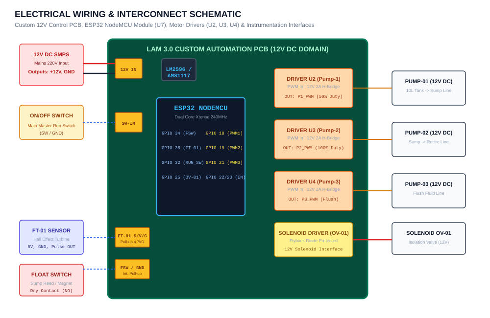

# Hardware Wiring & Electrical Commissioning Guide

**Project:** Lam Research Challenge 3.0 – Practical Engineering Challenge  
**Team Name:** TEAM DISTRO  
**Team ID:** LRC-26-0528  
**Document Ref:** ELEC-GUIDE-001  

---

## 1. Electrical System Overview

The control architecture is powered by an external **12 V DC Switched-Mode Power Supply (SMPS)**. The custom PCB interfaces the **ESP32 NodeMCU (U7)** with three 12V motor driver channels, one 12V solenoid valve interface, and digital/analog sensor inputs.

---

## 2. Hardware Pinout & PCB Interconnect Table

### 2.1 Power Supply Connectors
| Connector Label | Function | Voltage / Signal | Description |
|---|---|---|---|
| **12V INPUT** | Mains Power In | $+12\text{V DC} \pm 5\%$ & GND | Direct connection from 12V SMPS output terminals. |
| **5V / 3.3V BUS** | Logic Power Rail | $+5\text{V}$ & $+3.3\text{V DC}$ | On-board buck regulator supplying ESP32 and Hall sensor. |

### 2.2 Actuator & Driver Interfaces
| PCB Connector | Component Tag | Driver IC | ESP32 GPIO | Operating Parameters |
|---|---|---|---|---|
| **U2 (Motor Driver 1)** | Pump-01 | H-Bridge Driver | GPIO 18 (PWM Ch 0) | $5\text{ kHz}$ PWM, **50% Duty Cycle** (Recirculation feed). |
| **U3 (Motor Driver 2)** | Pump-02 | H-Bridge Driver | GPIO 19 (PWM Ch 1) | $5\text{ kHz}$ PWM, **100% Duty Cycle** (Sump discharge). |
| **U4 (Motor Driver 3)** | Pump-03 | H-Bridge Driver | GPIO 21 (PWM Ch 2) | $5\text{ kHz}$ PWM, **Flush Supply** (Case 2 only). |
| **SOLENOID_VALVE** | OV-01 (XV-01) | Power MOSFET / Flyback | GPIO 25 (Digital Out) | Active HIGH = OPEN, LOW = CLOSED (Isolates 10L tank). |

### 2.3 Sensor & User Interfaces
| PCB Connector | Component | Signal Type | ESP32 GPIO | Electrical Characteristic |
|---|---|---|---|---|
| **FLOW_SENSOR** | FT-01 Flow Transmitter | S / V / G | GPIO 35 (Interrupt) | 5V VCC, GND, Signal with $4.7\text{ k}\Omega$ pull-up resistor. |
| **FLOAT_SWITCH** | LS-01 Sump Level | FSW / GND | GPIO 34 (Digital In) | Dry contact reed switch; internal pull-up enabled. |
| **ON/OFF_SWITCH** | Master Run Switch | SW / GND | GPIO 32 (Digital In) | SPST toggle switch; active LOW when closed. |

---

## 3. Step-by-Step Commissioning Protocol

### Step 1: Pre-Power Cold Checks (Ohmic Verification)
1. Verify with a digital multimeter that no short circuit exists between the **+12V and GND terminals** on the PCB ($R > 10\text{ k}\Omega$).
2. Confirm ground continuity across all driver grounds, ESP32 GND, and the SMPS DC GND terminal.
3. Ensure the flyback diode across the **SOLENOID_VALVE** terminal is correctly oriented (cathode to +12V, anode to drain).

### Step 2: Power-Up & Rail Verification
1. Connect SMPS to AC mains and measure DC output: ensure voltage is strictly between **$11.8\text{V}$ and $12.4\text{V}$**.
2. Measure logic rails: confirm **$5.0\text{V}$** and **$3.3\text{V}$** regulated outputs are steady.

### Step 3: Sensor & Actuator Smoke Test
1. Actuate the manual ON/OFF switch and verify ESP32 boot banner over USB Serial at **115200 baud**.
2. Lift the Sump float switch manually: confirm serial output immediately transitions to `[FSM] -> CASE 1 LEVEL INTERLOCK`.
3. Blow gently through the FT-01 turbine or run minimal fluid: confirm pulses increment in serial telemetry.

### Step 4: Hydraulic Priming
1. Ensure all 8 mm tubing push-fit connections and reducers are seated past the internal O-ring.
2. Prime Pump-01 suction line to prevent dry-running impeller damage.
3. Open ball valve `BV-01` to 100% position before power-on to eliminate startup hydraulic hammer.
